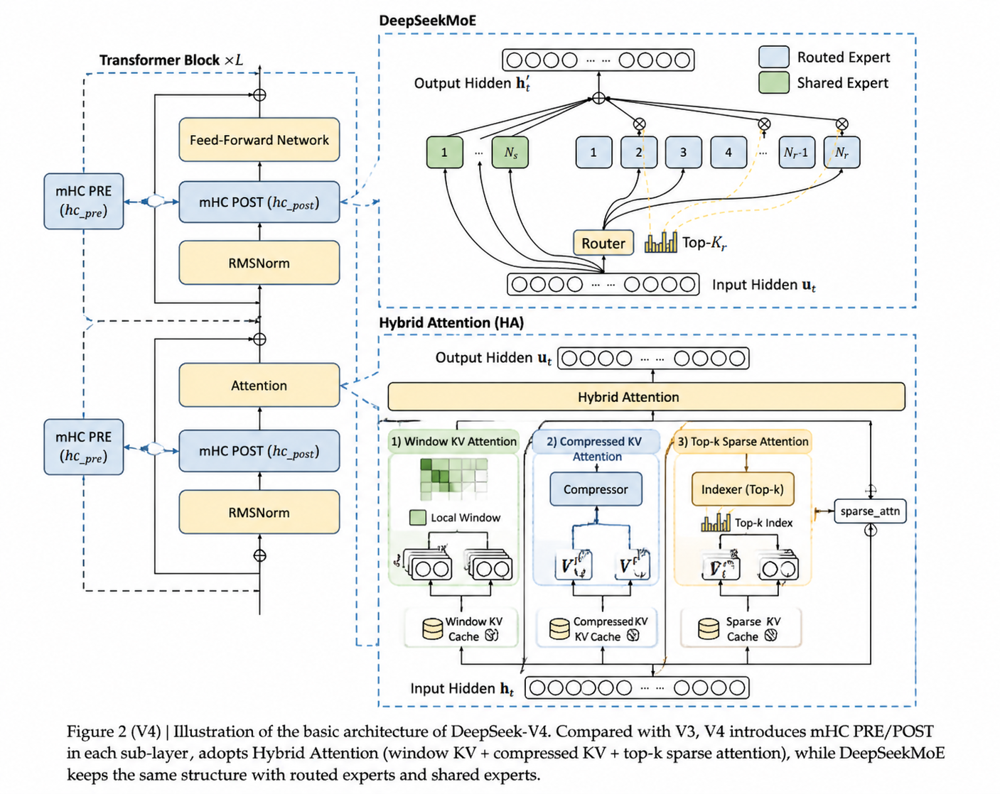
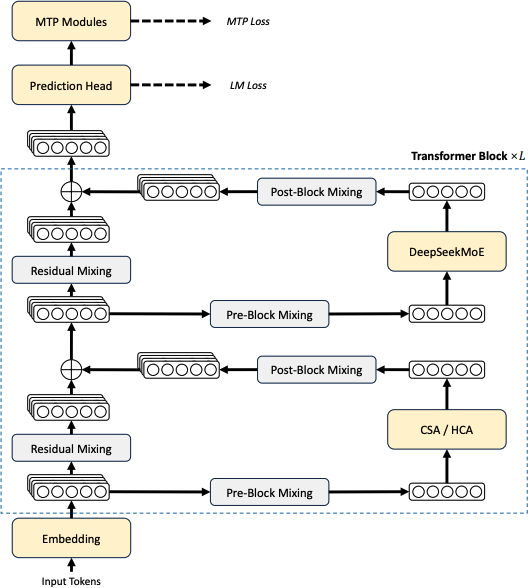

4 月 24 日，DeepSeek 发布其最新版本 DeepSeek-V4[^deepseek-v4] 技术报告，并同步开源代码与模型权重。DeepSeek-V4 在多项评测中达到 SOTA 水平；在效率方面，相较于 DeepSeek-V3.2，DeepSeek-V4-Pro 的单 token 推理 FLOPs 降至 27%，KV 缓存缩减至 10%，从而稳定支持百万级 token 的长上下文处理。

DeepSeek-V4 技术报告包含四部分内容：算法架构、基础设施（infra）、预训练、后训练。本文结合公开的技术报告与代码，聚焦算法架构部分；其余内容可参考完整[技术报告](https://huggingface.co/deepseek-ai/DeepSeek-V4-Pro/blob/main/DeepSeek_V4.pdf)。


## 算法架构概述

<a id="deepseek-v4-architecture"></a>
<figure>
  
  <figcaption>
    DeepSeek-V4 算法架构（由 Image-2 生成）
  </figcaption>
</figure>

DeepSeek-V4 的算法架构整体延续 DeepSeek-V3[^deepseek-v3] 的设计，主要在以下几个方面进行了优化：

- 将 Transformer block 中的残差连接（Residual Connection）替换为 mHC（Manifold-Constrained Hyper-Connections）
- 将 V3 的 MLA（Multi-Head Latent Attention）替换为混合注意力架构（Hybrid Attention Architecture）
- 使用 Muon 作为优化器

其他模块（如前馈网络 MoE 与多 Token 预测（MTP））基本与 V3 保持一致。

## Transformer Block

<a id="deepseek-v4-block"></a>
<figure>
  
  <figcaption>DeepSeek-V4 Transformer block 结构</figcaption>
</figure>

前两项优化点都发生在 Transformer block 内部。如上图所示：DeepSeek-V4 在注意力层混合使用 CSA（Compressed Sparse Attention）与 HCA（Heavily Compressed Attention），在前馈层使用 DeepSeekMoE，并通过 mHC 强化传统残差连接。

### mHC（Manifold-Constrained Hyper-Connections）

DeepSeek-V4 系列引入 mHC 用以强化相邻 Transformer block 之间的信号传播。与传统残差连接相比，可以把 mHC 理解为：把“一个残差流”升级成“多条并行残差流”。具体实现时，通过 `repeat` 将单个残差流扩展为多条并行残差流。

```python
h = h.unsqueeze(2).repeat(1, 1, self.hc_mult, 1) # 在进入 Transformer block 之前，先将残差流扩展为多条并行残差流
```
每一层会动态决定：（1）从哪些流里读出主表示去做子层计算；（2）把子层输出写回到哪些流里；（3）让这些流之间按一个受约束的“混合矩阵”交换信息。以下给出 mHC 和传统残差连接的代码对比：

```diff
def forward(self, x: torch.Tensor, start_pos: int, input_ids: Optional[torch.Tensor]) -> torch.Tensor:
    residual = x # [batch_size, seq_len, hc, hidden_size]
+   x, post, comb = self.hc_pre(x, self.hc_attn_fn, self.hc_attn_scale, self.hc_attn_base)
    x = self.attn_norm(x)
    x = self.attn(x, start_pos)
-   x = residual + x   # 传统残差连接，直接通过加法操作实现
+   x = self.hc_post(x, residual, post, comb)

    residual = x
+   x, post, comb = self.hc_pre(x, self.hc_ffn_fn, self.hc_ffn_scale, self.hc_ffn_base)
    x = self.ffn_norm(x)
    x = self.ffn(x, input_ids)
-   x = residual + x
+   x = self.hc_post(x, residual, post, comb)
    return x
```

mHC 实现里，输入的 `x` 是一个 **[batch_size, seq_len, hc, hidden_size]** 的张量，其中 `hc` 与 `hc_mult` 对应同一超参数，用于控制并行残差流的数量。

函数 `hc_pre` 决定“这一层该从哪几份副本读信息”，即从多流中计算主表示用于后续子层计算。下面给出一个实现片段：其中 `hc_fn` 可理解为线性映射的参数，用于将输入映射到 `mix_hc` 个维度；`hc_scale` 是 3 维张量，用于控制混合矩阵的约束；`hc_base` 是 `mix_hc` 维张量，用于初始化混合矩阵。

`hc_split_sinkhorn` 是一个函数，用于将混合矩阵拆分成 `pre`、`post` 和 `comb` 三部分，分别对应了“从哪些流里读取信息”、“写哪些流里”和“混合矩阵”。

```python
def hc_pre(self, x: torch.Tensor, hc_fn: torch.Tensor, hc_scale: torch.Tensor, hc_base: torch.Tensor):
    # x: [b,s,hc,d], hc_fn: [mix_hc,hc*d], hc_scale: [3], hc_base: [mix_hc], y: [b,s,hc,d]
    shape, dtype = x.size(), x.dtype
    x = x.flatten(2).float()
    rsqrt = torch.rsqrt(x.square().mean(-1, keepdim=True) + self.norm_eps)
    mixes = F.linear(x, hc_fn) * rsqrt
    pre, post, comb = hc_split_sinkhorn(mixes, hc_scale, hc_base, self.hc_mult, self.hc_sinkhorn_iters, self.hc_eps)
    y = torch.sum(pre.unsqueeze(-1) * x.view(shape), dim=2)
    return y.to(dtype), post, comb
```

`hc_post` 决定“子层的新信息写到哪些副本里，以及旧副本之间怎么混合”，即将子层的新信息写回到多流中，同时根据混合矩阵计算出新的主表示。这里用到 `post` 和 `comb` 两个张量，就是 `hc_pre` 中计算得到的分流矩阵和混合矩阵。

```python
def hc_post(self, x: torch.Tensor, residual: torch.Tensor, post: torch.Tensor, comb: torch.Tensor):
    # x: [b,s,d], residual: [b,s,hc,d], post: [b,s,hc], comb: [b,s,hc,hc], y: [b,s,hc,d]
    y = post.unsqueeze(-1) * x.unsqueeze(-2) + torch.sum(comb.unsqueeze(-1) * residual.unsqueeze(-2), dim=2)
    return y.type_as(x)
```

 
> **<span style="color:#2ECC71">混合矩阵的约束</span>**：在 mHC 中，每个 token / 层都会生成一个流间混合矩阵（代码里的 `comb`），用于在多条“残差流”之间搬运与重组旧状态。如果不加约束，混合矩阵可能出现尺度放大、信息坍缩到少数通道等问题，导致训练与深层信息传播不稳定。**Sinkhorn** 迭代通过交替进行行/列归一化，把混合矩阵投影到近似“双随机矩阵”（非负、行和列都约为 1）的集合附近，从而实现“质量守恒”的稳定混合：信息在通道间可交换，但不易无界放大或被单通道吸走。
> 
> `hc_sinkhorn_iters` 控制该投影的迭代次数，次数越多约束越严格但计算开销更大。

mHC 通过多流、可路由且受约束的残差机制，提升了表示的可分解性与信息传递灵活性，同时改善深层训练与长程依赖建模的稳定性。

### 混合注意力（Hybrid Attention）

尽管目前出现了各种注意力机制（Linear Attention、Sparse Attention、Heavily Compressed Attention 等），它们的核心目标大多是在尽量不损失效果的前提下提升计算效率。从实现形式上看，这些机制仍遵循自注意力的通用框架。下面给出一个简化的伪代码：

```python
def attention(self, x):
    q = x_to_q(x) 
    k = x_to_k(x) 
    v = x_to_v(x) 
    q, k, v = insert_position_embedding(q, k, v) # 注入位置编码
    o = apply_attention_mix(q, k, v) # 注意力计算，矩阵计算
    new_x = o_to_x(o) 
    return new_x
```

#### Q, K, V 映射与位置编码注入

首先介绍 `x_to_q`、`x_to_k`、`x_to_v` 这三个函数，它们将输入的 `x` 分别转换为查询、键值张量。`insert_position_embedding` 函数用于将位置编码注入到查询、键值张量中。 以下是 DeepSeek-V4 中的实现：

```python
# module
self.wq_a = Linear(self.dim, self.q_lora_rank)
self.wq_b = ColumnParallelLinear(self.q_lora_rank, self.n_heads * self.head_dim)
self.wkv = Linear(self.dim, self.head_dim)
self.q_norm = RMSNorm(self.q_lora_rank, self.eps)
self.kv_norm = RMSNorm(self.head_dim, self.eps)

# forward
qr = q = self.q_norm(self.wq_a(x))
q = self.wq_b(q).unflatten(-1, (self.n_local_heads, self.head_dim))
q *= torch.rsqrt(q.square().mean(-1, keepdim=True) + self.eps)
apply_rotary_emb(q[..., -rd:], freqs_cis)
kv = self.wkv(x)
kv = self.kv_norm(kv)
apply_rotary_emb(kv[..., -rd:], freqs_cis)
act_quant(kv[..., :-rd], 64, scale_fmt, scale_dtype, True)
```

使用线性层映射将输入映射到对应的维度空间，并使用相对位置编码注入位置信息；可以注意到多头的设置主要在 `q` 上。其中 `act_quant` 的作用是量化，把 KV 向量里“非 RoPE 的维度”做 QAT 对齐量化为 FP8 精度，而 RoPE 相关维度保持原精度，以兼顾“与训练时量化分布一致”和“位置编码精度”。

#### Sparse Attention

在完成 \(q\)、\(k\)、\(v\) 以及位置编码注入后，Hybrid Attention 的关键不在于对所有历史 token 计算完整的注意力矩阵，而是先为每个 query token 构造一个候选 KV 索引集合 `topk_idxs`，然后只在这些候选位置上做注意力计算（Sparse Attention）。这样复杂度从 \(O(L^2)\) 下降到近似 \(O(L \cdot K)\)，其中 \(K\) 是每个 query 对应的候选集合大小。

在 DeepSeek-V4 中，候选集合由两部分组成：

- **Window tokens（局部高保真）**：滑动窗口内的最近历史 token，保证局部依赖的精细建模。
- **Compressed tokens（全局低成本）**：对远程历史做压缩后得到的 KV 记忆，用少量 token 覆盖长上下文。

```python
topk_idxs = get_window_topk_idxs(win, bsz, seqlen, start_pos)

if self.compress_ratio:
    offset = kv.size(1) if start_pos == 0 else win
    if self.indexer is not None:
        compress_topk_idxs = self.indexer(x, qr, start_pos, offset)
    else:
        compress_topk_idxs = get_compress_topk_idxs(ratio, bsz, seqlen, start_pos, offset)
    topk_idxs = torch.cat([topk_idxs, compress_topk_idxs], dim=-1)

topk_idxs = topk_idxs.int()
```

其中：
- `win = window_size`：窗口大小（如 128）。
- `ratio = compress_ratio`：压缩比，`ratio>0` 表示该层启用压缩记忆。
- `offset`：将窗口索引与压缩索引映射到统一的 KV 缓存坐标系（prefill 与 decode 阶段略有不同）。关于 KV cache 的背景可参考 [Qwen3-Omni 博客](/p/qwen3-omni/#thinker-talker-%E5%88%86%E5%B1%82%E6%8E%A8%E7%90%86)的附加内容。


#### CSA 与 HCA：两种压缩策略的对应关系

在开源模型 DeepSeek-V4-Pro 中，模型一共有 61 层，对于每一层注意力机制的压缩率列表如下：

```python
compress_ratios = [128, 128, 4, 128, 4, 128, 4, 128, 4, 128, 4, 128, 4, 128, 4, 128, 4, 128, 4, 128, 4, 128, 4, 128, 4, 128, 4, 128, 4, 128, 4, 128, 4, 128, 4, 128, 4, 128, 4, 128, 4, 128, 4, 128, 4, 128, 4, 128, 4, 128, 4, 128, 4, 128, 4, 128, 4, 128, 4, 128, 4, 0]
```

除了最后一层，其余层都对历史窗口做了不同程度的压缩，压缩比的选择分别是 $4$ 和 $128$ 两种，分别对应 CSA（Compressed Self Attention, `compress_ratio=4`）和 HCA（Heavy Compressed Attention, `compress_ratio=128`）两种压缩注意力机制。

两种压缩注意力机制在筛选候选 KV 索引时，分别采用不同的策略。CSA 更强调“相关性选择”，HCA 更强调“极致压缩”。

- **CSA（Compressed Sparse Attention）**：轻度压缩 + 稀疏检索。该模式下会启用 `Indexer`：对压缩 KV 做学习型相关性打分，并为每个 query 选择 top-k 压缩位置，从而实现“压缩 + 稀疏检索”的长程注意力。

<details>
<summary>CSA 选择器层 代码实现 （可跳过，本篇暂不展开讨论实现细节）</summary>

```python
class Compressor(nn.Module):
    """Compresses KV cache via learned gated pooling over `compress_ratio` consecutive tokens.
    When overlap=True (ratio==4), uses overlapping windows for smoother compression boundaries."""

    def __init__(self, args: ModelArgs, compress_ratio: int = 4, head_dim: int = 512, rotate: bool = False):
        super().__init__()
        self.dim = args.dim
        self.head_dim = head_dim
        self.rope_head_dim = args.rope_head_dim
        self.nope_head_dim = head_dim - args.rope_head_dim
        self.compress_ratio = compress_ratio
        self.overlap = compress_ratio == 4
        self.rotate = rotate
        coff = 1 + self.overlap

        self.ape = nn.Parameter(torch.empty(compress_ratio, coff * self.head_dim, dtype=torch.float32))
        # wkv and wgate in the checkpoint is stored in bf16, while the parameter here is stored in fp32 for convenient.
        # When overlap, the first half of dims is for overlapping compression, second half for normal.
        self.wkv = Linear(self.dim, coff * self.head_dim, dtype=torch.float32)
        self.wgate = Linear(self.dim, coff * self.head_dim, dtype=torch.float32)
        self.norm = RMSNorm(self.head_dim, args.norm_eps)
        self.kv_cache: torch.Tensor = None  # assigned lazily from Attention.kv_cache
        # State buffers for decode-phase incremental compression.
        # With overlap: state[:, :ratio] = overlapping window, state[:, ratio:] = current window.
        self.register_buffer("kv_state", torch.zeros(args.max_batch_size, coff * compress_ratio, coff * self.head_dim, dtype=torch.float32), persistent=False)
        self.register_buffer("score_state", torch.full((args.max_batch_size, coff * compress_ratio, coff * self.head_dim), float("-inf"), dtype=torch.float32), persistent=False)
        self.freqs_cis: torch.Tensor = None

    def overlap_transform(self, tensor: torch.Tensor, value=0):
        # tensor: [b,s,r,2d]
        b, s, _, _ = tensor.size()
        ratio, d = self.compress_ratio, self.head_dim
        new_tensor = tensor.new_full((b, s, 2 * ratio, d), value)
        new_tensor[:, :, ratio:] = tensor[:, :, :, d:]
        new_tensor[:, 1:, :ratio] = tensor[:, :-1, :, :d]
        return new_tensor

    def forward(self, x: torch.Tensor, start_pos: int):
        assert self.kv_cache is not None
        bsz, seqlen, _ = x.size()
        ratio, overlap, d, rd = self.compress_ratio, self.overlap, self.head_dim, self.rope_head_dim
        dtype = x.dtype
        # compression need fp32
        x = x.float()
        kv = self.wkv(x)
        score = self.wgate(x)
        if start_pos == 0:
            should_compress = seqlen >= ratio
            remainder = seqlen % ratio
            cutoff = seqlen - remainder
            offset = ratio if overlap else 0
            if overlap and cutoff >= ratio:
                self.kv_state[:bsz, :ratio] = kv[:, cutoff-ratio : cutoff]
                self.score_state[:bsz, :ratio] = score[:, cutoff-ratio : cutoff] + self.ape
            if remainder > 0:
                kv, self.kv_state[:bsz, offset : offset+remainder] = kv.split([cutoff, remainder], dim=1)
                self.score_state[:bsz, offset : offset+remainder] = score[:, cutoff:] + self.ape[:remainder]
                score = score[:, :cutoff]
            kv = kv.unflatten(1, (-1, ratio))
            score = score.unflatten(1, (-1, ratio)) + self.ape
            if overlap:
                kv = self.overlap_transform(kv, 0)
                score = self.overlap_transform(score, float("-inf"))
            kv = (kv * score.softmax(dim=2)).sum(dim=2)
        else:
            should_compress = (start_pos + 1) % self.compress_ratio == 0
            score += self.ape[start_pos % ratio]
            if overlap:
                self.kv_state[:bsz, ratio + start_pos % ratio] = kv.squeeze(1)
                self.score_state[:bsz, ratio + start_pos % ratio] = score.squeeze(1)
                if should_compress:
                    kv_state = torch.cat([self.kv_state[:bsz, :ratio, :d], self.kv_state[:bsz, ratio:, d:]], dim=1)
                    score_state = torch.cat([self.score_state[:bsz, :ratio, :d], self.score_state[:bsz, ratio:, d:]], dim=1)
                    kv = (kv_state * score_state.softmax(dim=1)).sum(dim=1, keepdim=True)
                    self.kv_state[:bsz, :ratio] = self.kv_state[:bsz, ratio:]
                    self.score_state[:bsz, :ratio] = self.score_state[:bsz, ratio:]
            else:
                self.kv_state[:bsz, start_pos % ratio] = kv.squeeze(1)
                self.score_state[:bsz, start_pos % ratio] = score.squeeze(1)
                if should_compress:
                    kv = (self.kv_state[:bsz] * self.score_state[:bsz].softmax(dim=1)).sum(dim=1, keepdim=True)
        if not should_compress:
            return
        kv = self.norm(kv.to(dtype))
        if start_pos == 0:
            freqs_cis = self.freqs_cis[:cutoff:ratio]
        else:
            freqs_cis = self.freqs_cis[start_pos + 1 - self.compress_ratio].unsqueeze(0)
        apply_rotary_emb(kv[..., -rd:], freqs_cis)
        if self.rotate:
            kv = rotate_activation(kv)
            fp4_act_quant(kv, fp4_block_size, True)
        else:
            act_quant(kv[..., :-rd], 64, scale_fmt, scale_dtype, True)
        if start_pos == 0:
            self.kv_cache[:bsz, :seqlen // ratio] = kv
        else:
            self.kv_cache[:bsz, start_pos // ratio] = kv.squeeze(1)
        return kv


class Indexer(torch.nn.Module):
    """Selects top-k compressed KV positions for sparse attention via learned scoring.
    Has its own Compressor (with Hadamard rotation) to build compressed KV for scoring."""

    def __init__(self, args: ModelArgs, compress_ratio: int = 4):
        super().__init__()
        self.dim = args.dim
        self.n_heads = args.index_n_heads
        self.n_local_heads = args.index_n_heads // world_size
        self.head_dim = args.index_head_dim
        self.rope_head_dim = args.rope_head_dim
        self.index_topk = args.index_topk
        self.q_lora_rank = args.q_lora_rank
        self.wq_b = ColumnParallelLinear(self.q_lora_rank, self.n_heads * self.head_dim)
        self.weights_proj = ColumnParallelLinear(self.dim, self.n_heads, dtype=torch.bfloat16)
        self.softmax_scale = self.head_dim ** -0.5
        self.compress_ratio = compress_ratio

        self.compressor = Compressor(args, compress_ratio, self.head_dim, True)
        self.register_buffer("kv_cache", torch.zeros(args.max_batch_size, args.max_seq_len // compress_ratio, self.head_dim), persistent=False)
        self.freqs_cis = None

    def forward(self, x: torch.Tensor, qr: torch.Tensor, start_pos: int, offset: int):
        bsz, seqlen, _ = x.size()
        freqs_cis = self.freqs_cis[start_pos:start_pos+seqlen]
        ratio = self.compress_ratio
        rd = self.rope_head_dim
        end_pos = start_pos + seqlen
        if self.compressor.kv_cache is None:
            self.compressor.kv_cache = self.kv_cache
            self.compressor.freqs_cis = self.freqs_cis
        q = self.wq_b(qr)
        q = q.unflatten(-1, (self.n_local_heads, self.head_dim))
        apply_rotary_emb(q[..., -rd:], freqs_cis)
        q = rotate_activation(q)
        # use fp4 simulation for q and kv in indexer
        fp4_act_quant(q, fp4_block_size, True)
        self.compressor(x, start_pos)
        weights = self.weights_proj(x) * (self.softmax_scale * self.n_heads ** -0.5)
        # We performed QAT here, kv could also use fp8 format, though current implementation uses bf16
        index_score = torch.einsum("bshd,btd->bsht", q, self.kv_cache[:bsz, :end_pos // ratio])
        index_score = (index_score.relu_() * weights.unsqueeze(-1)).sum(dim=2)
        if world_size > 1:
            dist.all_reduce(index_score)
        if start_pos == 0:
            mask = torch.arange(seqlen // ratio).repeat(seqlen, 1) >= torch.arange(1, seqlen + 1).unsqueeze(1) // ratio
            index_score += torch.where(mask, float("-inf"), 0)
        topk_idxs = index_score.topk(min(self.index_topk, end_pos // ratio), dim=-1)[1]
        if start_pos == 0:
            mask = topk_idxs >= torch.arange(1, seqlen + 1).unsqueeze(1) // ratio
            topk_idxs = torch.where(mask, -1, topk_idxs + offset)
        else:
            topk_idxs += offset
        return topk_idxs

```
</details>

- **HCA（Heavily Compressed Attention）**：重度压缩。此时压缩 token 数量极少，更偏向全局摘要记忆；实现上一般不启用学习检索，而是使用规则映射生成压缩候选索引，以获得极低成本的长上下文覆盖。

<details>
<summary> HCA 选择函数 代码实现 </summary>

```python
def get_compress_topk_idxs(ratio: int, bsz: int, seqlen: int, start_pos: int, offset: int):
    if start_pos > 0:
        matrix = torch.arange(0, (start_pos + 1) // ratio) + offset
    else:
        matrix = torch.arange(seqlen // ratio).repeat(seqlen, 1)
        mask = matrix >= torch.arange(1, seqlen + 1).unsqueeze(1) // ratio
        matrix = torch.where(mask, -1, matrix + offset)
    return matrix.unsqueeze(0).expand(bsz, -1, -1)
```

</details>

在获取到候选索引 `topk_idxs` 后，模型调用 `sparse_attn(q, kv_cache, ...)` 仅对候选位置执行注意力计算。模型只需关注候选集合中的有效 token，而无需处理所有历史 token，从而实现高效计算。

#### 输出投影

注意力输出 `o` 会先对 RoPE 维做逆变换（inverse），再通过分组的低秩输出投影映射回原始维度空间，得到该注意力层的最终输出：

<details>
<summary>查看代码：输出投影</summary>

```python
apply_rotary_emb(o[..., -rd:], freqs_cis, inverse=True)
o = o.view(bsz, seqlen, self.n_local_groups, -1)
wo_a = self.wo_a.weight.view(self.n_local_groups, self.o_lora_rank, -1)
o = torch.einsum("bsgd,grd->bsgr", o, wo_a)
new_x = self.wo_b(o.flatten(2))
```

</details>

至此，Hybrid Attention 在保持窗口注意力高保真建模能力的同时，引入压缩记忆与稀疏计算，实现长上下文场景下的高效注意力计算。


## Muon

本节不展开 Muon 的细节，可参考 [Moonshot Muon](https://github.com/MoonshotAI/Moonlight)。

### DeepSeek-V4 优化器配置细节

DeepSeek-V4 对优化器采用精细化分工：

| 优化器 | 覆盖参数 |
|--------|----------|
| **AdamW**（Loshchilov & Hutter, 2017） | 嵌入层、预测头、mHC 静态偏置与门控、全部 RMSNorm 权重 |
| **Muon** | 除上述外的所有可训练参数 |

Muon 实现沿用 Moonshot 版三项核心技巧：

- 对 Muon 参数施加 **权重衰减**  
- 引入 **Nesterov 动量** 提升收敛稳定性  
- 对更新矩阵做 **RMS 重缩放**，直接复用 AdamW 超参数，无需二次调参  

与原版差异：  
- 正交化步骤改用 **混合 Newton-Schulz 迭代**，兼顾数值精度与低延迟  
- 移除 **QK-Clip** 技巧


> **<span style="color:#FF6B35">如有错误或遗漏，欢迎指正！</span>**

[^deepseek-v4]: DeepSeek-AI, DeepSeek-V4: Towards Highly Efficient Million-Token Context Intelligence. https://huggingface.co/collections/deepseek-ai/deepseek-v4

[^deepseek-v3]: DeepSeek-AI, DeepSeek-V3 Technical Report. https://github.com/deepseek-ai/DeepSeek-V3
