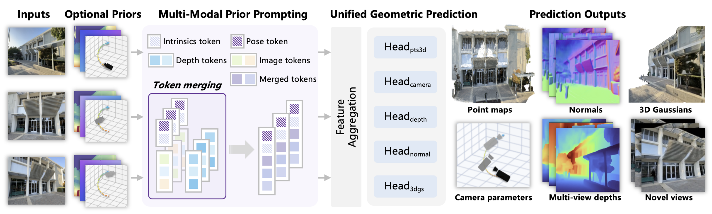

## 什么是3D重建？

<a id="world-models-figure"></a>
<figure>
  
</figure>


在数字世界里，2D 信息就是一张张图像：它们由像素排成的平面画布组成，每个像素只携带 (x, y) 坐标和颜色、亮度等属性，像一幅挂在墙上的画。而 3D 信息则像把画撕下来、折成立体纸雕——点不再只是平面上的像素，而是拥有了 (x, y, z) 三维坐标的“点云”；它们可以描述凹凸、距离与体积。

3D 重建是从一组 2D 图像恢复场景三维几何与外观的过程：用相机从多个角度采集同一场景的图像，通过特征匹配、三角测量或神经网络推理，把不同视角下的像素或特征“拼回”三维空间，最终输出点云、网格、深度图或 3D 高斯等表示，供测量、渲染或编辑使用。根据算法设计，输入可少至单张图像，也可多达数百帧视频；输出亦不限于点云，而是涵盖任何可描述 3D 结构的数据格式。

### Feed-Forward 3D 重建

Feed-Forward 3D 重建是 3D 重建（3D Reconstruction）领域中一种新兴的范式。

<span style="color:#FF6B35">传统的 3D 重建（如 SfM/MVS、早期 NeRF）</span> 像是一位严谨的“雕塑家”。你必须让模特站好，雕塑家要围着模特走一圈，仔细观察每个角度（多视角输入），然后对着这个特定的模特一点点凿刻、反复修改，耗费数小时甚至数天才能完成作品（单场景迭代优化 Per-scene Optimization）。

<span style="color:#FF6B35">Feed-Forward 3D 重建</span> 则像是一位阅历无数、极其敏捷的“速写大师 + 3D 打印机”。你只需要给他看一张模特正面的照片（单图 / 稀疏视角输入），他凭借过去看过成千上万个人的经验（大规模数据集预训练的先验知识），瞬间就能在脑海里“脑补”出模特背面的样子，并在几秒钟内直接“打印”出 3D 模型。他不需要对着这张照片重新学习或反复打磨，只需看一眼就直接出结果（神经网络一次前向传播 Single Forward Pass）。


| 特性 | 传统的 3D 重建（基于优化） | Feed-Forward 3D（基于前馈网络） |
|---|---|---|
| 代表技术 | SfM、MVS、基础 NeRF、基础 3D Gaussian Splatting | VGGT、WorldMirror 等“大重建模型” |
| 输入要求 | 高：通常需要几十到上百张覆盖全视角的图片，并且往往需要（或需要先估计）较准确的相机参数 | 低：通常只需要单张图片，或极少量几张图片（稀疏视角）；可把相机/深度等信息当作可选条件输入 |
| 计算过程 | 慢：针对当前场景做迭代优化，通过大量循环计算逐步收敛 | 快：数据一次通过预训练网络，直接输出 3D 表示（如三平面、点云、3D 高斯） |
| 耗时 | 十几分钟到数天（取决于场景规模与优化设置） | 几百毫秒到几秒（取决于模型与分辨率） |
| 对未知区域 | 弱：未观测区域容易破洞、模糊或不稳定，需要更多视角或更强先验 | 强：依赖训练先验做“补全/猜测”，结果往往更完整，但不保证严格物理真实 |
| 精度与细节 | 高：慢工出细活，几何一致性强 | 中等到较高：受模型容量与数据分布影响，细节可能更“平均化”；常用后期优化精修 |


## HunyuanWorld-Mirror

HunyuanWorld-Mirror[^worldmirror] 是“前馈式（feed-forward）3D 重建”模型：给定单张或多张图像序列，并可选地提供几何先验（相机位姿 / 相机内参 / 深度），模型在一次前向传播中同时输出多种 3D 表示（点图，相机参数，多视角深度图，表面法线估计，3D 高斯），从而把传统的“估位姿→算深度→建模→渲染/导出”的链条压缩成更短的数据流。

### 数据流


本章根据 WorldMirror 的结构图，介绍重建模型从输入到输出的数据流过程。下图展示了 WorldMirror 的结构

<a id="world-mirror-figure"></a>
<figure>
  
</figure>

模型的输入包括单张或多张不同视角的图像序列，以及可选的 3D 先验作为辅助信息。给定输入后，模型内部会先把每种可选先验分别编码为 token，与图像 token 融合；随后通过视觉 Transformer 主干网络聚合多视角特征；最后将聚合后的表征送入多头预测器，一次前向输出点图、相机参数、多视角深度图、表面法线与 3D 高斯。

#### 输入与输出

模型输入包括：多视角图像序列，以及可选的几何先验（相机位姿、相机内参、深度图）。一次前向传播后，模型直接输出以下 3D 表示：

- **相机参数**：模型矫正后的相机内外参
- **多视角深度图**：模型矫正后的深度图
- **表面法线**：以 RGB 表示方向向量的 2D 图像，使 3D 模型在光照下呈现正确阴影与高光
- **点图**：3D 空间中离散点的集合，每个点包含 $(x, y, z)$ 坐标与颜色
- **3D 高斯**：用数以万计至百万计的“3D 椭球体”组成场景，每个高斯球含中心位置、大小、旋转、不透明度与颜色（球谐函数）


#### Token处理与聚合

考虑到输入之间的模态差异，各类 token 的处理方式有所不同。在实际实现中，有 6 种不同来源的 token 被聚合成一个长序列，下表给出每种 token 的处理方式和来源：

| Token 类型 | 形状（每帧） | 来源 | 职责 |
|---|---|---|---|
| patch_tokens | $[P, D]$ | 图像经 PatchEmbed | 承载像素级外观信息，序列主体 |
| cam_tokens | $[1, D]$ | 可学习参数 | 全局查询："相机参数是什么？" |
| reg_tokens | $[4, D]$ | 可学习参数 | 吸收全局噪声 / 汇聚跨帧信息（DINOv2 register 思想） |
| pose_tokens | $[1, D]$ | 相机位姿先验 → MLP | 注入已知外参（条件） |
| ray_tokens | $[1, D]$ | 内参先验 → MLP | 注入焦距 / 光心（条件） |
| depth_tokens | $[P, D]$ | 深度先验经 PatchEmbed | 注入已知深度（与 patch_tokens **相加**，而非拼接） |


其中深度信息（depth_tokens）与图像 patch_tokens 相对齐，depth_tokens 会被残差连接到对应的 patch_tokens 中。

```python
depth_flat = depth_maps.reshape(B*S, 1, H, W) 
depth_emb  = self.depth_embed(depth_flat)  
depth_tokens = depth_emb.reshape(B*S, P, D) 
patch_tokens = patch_tokens + depth_tokens  
```

其余 token 通过拼接聚合成最终长 token 序列，

```python
all_tokens = concat([cam_tokens, reg_tokens, pose_tokens, ray_tokens, patch_tokens], dim=1)
```


#### 注意力交互与中间层特征提取

每层 Transformer 包含两个串行的注意力阶段，包括 frame attention 和 global attention。在不同的 attention 阶段，token 的形状会变化：

```python
frame attention：  [B, S, N, D]  →  在 N 上做 self-attention（每帧独立）
global attention：[B, S*N, D]   →  在 S*N 上做 self-attention（所有帧全部交互）
```

这样做的目的是实现信息之间的阶段式交互：frame attention 会保持帧的独立性，token 只和同一帧内的其他 token 交互，相当于“先看清每帧里有什么”；global attention 把帧维展平，所有帧的 token 打成一片做 self-attention，相当于“再建立跨帧的对应关系”。

每一层结束后，判断当前层是否在 intermediate_idxs 列表中；如果在，则把特征保留到列表中用于后续处理。这些多层次的 outputs 会被传给 DPTHead，分别做不同分辨率的上采样与多尺度融合，最终生成稠密预测图（深度/法线/点等）。

```python
for idx in range(depth):           # depth = 24（large模型）
    local_tokens  = frame_block(...)
    global_tokens = global_block(...)

    if idx in intermediate_idxs:   # e.g. [4, 11, 17, 23]
        combined = concat([local_tokens, global_tokens], dim=-1)
        outputs.append(combined)   # 沿通道维度拼接 → [B*S, N, 2D]
```


#### 预测和解码

模型从主干提取的 token_list（多层 local + global 拼接特征）出发，通过四条并行的解码头从同一表征空间“投影”出不同任务：

- 相机（cam_head）：cam_head 直接消费 token_list（不经过 DPT 解码），输出相机参数向量（7D/14D 等），再经 `transform_camera_vector` 转成 c2w 外参矩阵和内参 K。
- 稠密预测（depth/pts/normals）：三者共享 DPTHead 架构，均经过 _extract_fused_features（多尺度特征融合 + 上采样），然后用各自专属的激活函数映射到物理量（参考 VGGT[^vggt]）。
- 3DGS（gs_head + gs_renderer）：gs_head 从 transformer 的多尺度 token 融合出场景特征图和对应的深度图；特征图再经过一个小型 CNN 直接回归出每个像素对应的高斯参数（形状、旋转、不透明度、颜色），深度图结合相机参数将每个高斯投影到三维空间位置，最终所有高斯及其属性被打包输出为 splats ——这是一种可渲染的显式三维表示。


### 附加训练信息

WorldMirror 采用端到端联合训练，模型通过最小化一个多任务复合损失函数实现所有预测头的同步学习：

\[
\mathcal{L} = \mathcal{L}_{\text{points}} + \mathcal{L}_{\text{depth}} + \mathcal{L}_{\text{cam}} + \mathcal{L}_{\text{normal}} + \mathcal{L}_{\text{3dgs}}
\]

在训练阶段，WorldMirror 的训练数据来自 15 个不同来源的数据集，涵盖多种场景类型与采集条件。这些数据集覆盖室内 / 室外环境、真实 / 合成场景、静态 / 动态物体，为模型提供了丰富的监督信号，使其能够学习到泛化能力较强的几何表征。

> **<span style="color:#FF6B35">如有错误或遗漏，欢迎指正！</span>**

[^worldmirror]: Liu Y, Min Z, Wang Z, et al. Worldmirror: Universal 3d world reconstruction with any-prior prompting[J]. https://github.com/Tencent-Hunyuan/HunyuanWorld-Mirror 
[^vggt]: Wang J, Chen M, Karaev N, et al. Vggt: Visual geometry grounded transformer. https://github.com/facebookresearch/vggt
