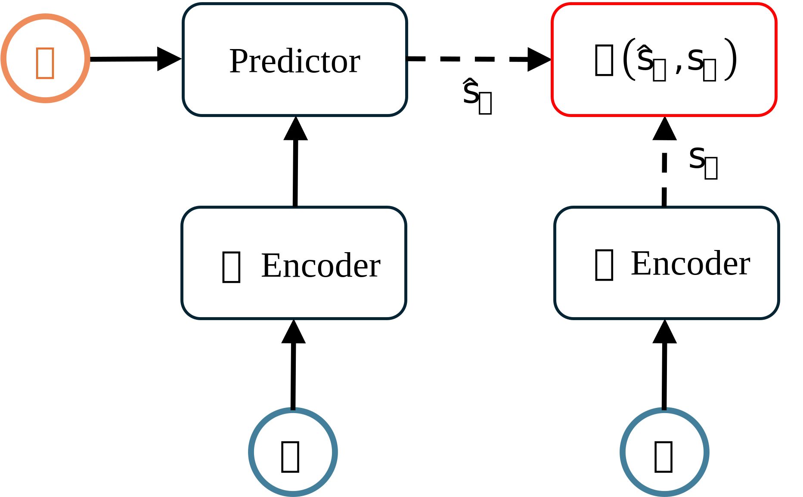

## 引言

JEPA[^jepa]（Joint Embedding Predictive Architecture）是由 [LeCun](http://yann.lecun.com/) 等人提出的一类预测学习框架。本篇笔记分四个部分：先介绍 JEPA 的核心直觉（无数学推导），再解释 JEPA 的技术架构，然后以开源实现为例说明其推理与训练细节，最后补充一些问题与个人理解。

### World Models

在介绍 JEPA 之前，先用 World Models（世界模型）做一个铺垫。世界模型可以理解为“环境的内部模拟器”，常见组件包括：

- **状态（State）**：对当前世界状况的表征，通常由传感器或特征提取器给出。
- **动作（Action）**：智能体可执行的操作集合，用于干预世界。
- **记忆（Memory）**：对过去状态与动作的长期存储，用于推断未来。
- **预测（Prediction）**：基于当前状态与动作对未来状态的估计。
- **规划（Planning）**：利用预测结果选择最优动作序列以达成目标。

<a id="world-models-figure"></a>
<figure>
  
  <figcaption>世界模型架构示意图</figcaption>
</figure>

> _补充：在强化学习语境下，世界模型还常包含“转移（transition）”与“奖励（reward）”等概念；这里为了贴合 JEPA 的讨论，只保留与“表征—预测—规划”最相关的部分。_

简言之，世界模型让智能体能在“脑内”展开未来，从而在不实际试错的情况下评估策略、降低探索成本。JEPA 可以被视为在表征学习与预测这条链路上提供了一种更稳健的建模方式：把原始输入映射到潜空间，并在潜空间里预测下一步的表征。


### JEPA的核心理论

人在记忆或回想一个场景时，并不会逐像素保存所有细节，而是把“关键对象的属性与关系”压缩成一段“摘要”。在机器学习里，这种摘要通常对应嵌入（embedding）：用一个低维向量保留对下游任务最有用的信息。

JEPA 的核心思路是：先把输入的图像、视频、文本等原始数据编码成嵌入，再基于已经发生的上下文去预测“下一步嵌入”。换句话说，它用潜空间的“摘要”去推演“下一幕”，而不是直接在像素或 token 级别做逐点预测。


### JEPA的技术架构

JEPA 的技术架构并不复杂，如下图所示。它的主要组件包括：将原始数据压缩进表征空间的 Encoder（编码器），以及在条件信息（例如动作、历史上下文）下预测未来表征的 Predictor（预测器）。

<figure>
  
  <figcaption>JEPA架构示意图</figcaption>
</figure>

其中，\(x\) 与 \(y\) 都表示原始输入，并且两者在数据集中存在配对关系：例如时序关系（\(y\) 是 \(x\) 的下一时刻观测），或空间/视角关系（\(y\) 与 \(x\) 在同一场景中具有对应关系）。\(z\) 表示预测器依赖的控制条件：可以是 \(x\rightarrow y\) 的动作，也可以是掩码/可见区域等结构化条件（例如 I-JEPA[^i-jepa]、V-JEPA[^v-jepa]）。

训练时，JEPA 通过共享编码器或参数绑定等方式，把 \(x\) 与 \(y\) 的编码器输出 \(S_x\)、\(S_y\) 对齐到同一向量空间，并学习让预测表征 \(\hat{S}_y\) 逼近 \(S_y\)。这样编码器与预测器就在同一个“联合向量空间”里工作。

>**<span style="color:#2ECC71">联合向量空间（Joint Embedding Space）</span>**<span style="color:#2ECC71">是指将不同输入数据的压缩表示（embedding）映射到一个共同的向量空间中，从而能够将不同模态的输入数据进行统一的表示和处理；这也是JEPA的关键所在。</span>

实际应用中，JEPA 往往还需要配合额外的稳定性设计，例如在表征上引入正则（如 SIGReg，参考 LeWorldModel[^le-wm]），或使用 EMA（Exponential Moving Average）等技巧来缓解表征坍缩与训练不稳定。

### JEPA的代码实现

本章将介绍 JEPA 的代码实现，参考的开源项目包括 [LeWorldModel](https://github.com/lucas-maes/le-wm)、[I-JEPA](https://github.com/facebookresearch/ijepa)。对每个实现，主要关注其下游任务设定，以及推理与训练的关键细节。

#### LeWorldModel

**下游任务与推理**：LeWorldModel[^le-wm] 选择的下游任务是规划（planning），可参考上文的[世界模型架构示意图](#world-models-figure)。直观上，JEPA 负责在潜空间里“滚动预测”，从而让规划算法能够在内部模拟器中评估动作序列的好坏。

具体地说，给定初始观测 \(o_1\) 与目标观测 \(o_g\)，希望在规划时域 \(H\) 内求解动作序列 \(\{a_1, a_2, \ldots, a_H\}\)，使系统从 \(o_1\) 出发尽可能“靠近”目标 \(o_g\)。

官方给出的做法是：先把观测编码到潜空间。给定 \(o_1\)，得到初始潜变量 \(\hat{z}_1=\mathrm{enc}_{\theta}(o_1)\)。然后对候选动作序列做 rollout，在规划时域 \(H\) 内按动作展开潜状态：
\[
\hat{z}_{t+1}=\mathrm{pred}_{\phi}(\hat{z}_t,a_t).
\]
最终的目标是让末端预测潜状态 \(\hat{z}_H\) 接近目标观测 \(o_g\) 的潜表示 \(z_g=\mathrm{enc}_{\theta}(o_g)\)，即最小化终端代价
\[
\mathcal{C}(\hat{z}_H)=\|\hat{z}_H-z_g\|_2^2,
\]
因此规划问题等价于在 JEPA 的联合向量空间中搜索/优化动作序列，从而得到从 \(o_1\) 朝向目标的最优控制序列 \(\{a_1,a_2,\ldots,a_H\}\)：
\[
a_{1:H}^{*}=\arg\min_{a_{1:H}}\mathcal{C}(\hat{z}_H),
\]
在优化时，编码器与预测器参数保持固定；动作序列通常随机初始化，并用 CEM（Cross-Entropy Method）这类采样式优化方法迭代更新动作分布：采样一批候选序列 → rollout 得到 \(\hat{z}_H\) → 计算代价 \(\mathcal{C}(\hat{z}_H)\) → 选取精英样本并更新采样分布，直到收敛或达到迭代上限。

**训练**：由于需要编码的输入是图像，LeWorldModel 使用 ViT 作为图像编码器：

```python
encoder = spt.backbone.utils.vit_hf(cfg.encoder_cfg) # 编码器backbone
projector = MLP(input_dim=hidden_dim, output_dim=embed_dim, **kwargs)

def encode(self, info):
    # 处理原始数据到对应格式
    pixels = info['pixels'].float()
    b = pixels.size(0)
    pixels = rearrange(pixels, "b t ... -> (b t) ...") # flatten for encoding

    # 编码器编码，并提取ViT输出的cls token作为图像表示
    output = self.encoder(pixels, interpolate_pos_encoding=True)
    pixels_emb = output.last_hidden_state[:, 0]  # cls token
    
    # 映射到对应的维度
    emb = self.projector(pixels_emb)
    info["emb"] = rearrange(emb, "(b t) d -> b t d", b=b)
    return info
```

预测器的核心部分是一个 Transformer 架构，其作用是基于历史的图像 token 预测未来的图像 token：

```python
predictor = ARPredictor(cfg.predictor_cfg) # 内部主要是一个Transformer架构
predictor_proj = MLP(input_dim=hidden_dim, output_dim=embed_dim, **kwargs)

def predict(self, emb, act_emb):
    # 预测未来状态的潜变量，并映射到对应的维度
    preds = self.predictor(emb, act_emb)
    preds = self.pred_proj(rearrange(preds, "b t d -> (b t) d"))
    preds = rearrange(preds, "(b t) d -> b t d", b=emb.size(0))
    return preds
```

LeWorldModel 的训练目标由两部分组成：预测损失与正则化损失。预测损失计算连续时间步上预测潜变量与目标潜变量的均方误差，以对齐预测器输出与编码器表征。其训练 `forward` 伪代码如下：

```python
def lejepa_forward(self, batch, stage, lambd):
    emb, act_emb, tgt_emb = self.model.encode(batch)
    pred_emb = self.model.predict(emb, act_emb) # pred
    # 计算预测损失
    output["pred_loss"] = (pred_emb - tgt_emb).pow(2).mean()
    # 计算正则化损失
    output["sigreg_loss"]= self.sigreg(emb.transpose(0, 1))
    output["loss"] = output["pred_loss"] + lambd * output["sigreg_loss"]  
    return output
```

只学习预测损失容易带来收敛不稳定（表征坍缩）。LeWorldModel 通过引入 SIGReg[^sigreg] 正则化缓解这一问题。

#### I-JEPA

WIP（有空再更新）

### FAQ

* JEPA 是比 NTP 或 Diffusion 模型更好的建模方式？

就目前看到的工作而言，JEPA 更强调规划与自监督表征学习，而 NTP/Diffusion 更常用于生成与条件生成，两者关注点并不完全相同。JEPA 是否能在更广泛的生成任务上形成显著优势，还需要更多证据与系统性对比。

* JEPA有哪些优势？

优势比较直观：潜空间压缩使推理更高效；自监督学习减少对人工标注的依赖。

* 个人吐槽

目前不少 AI 媒体喜欢用“技术革命”“主流架构”等词去描述一些相对朴素的想法。实际看下来，JEPA 仍处在较早期阶段，仍需要在训练稳定性、可扩展性与任务覆盖面上继续验证。

> **<span style="color:#FF6B35">如有错误或遗漏，欢迎指正！</span>**


[^jepa]: LeCun Y. A path towards autonomous machine intelligence. https://openreview.net/pdf?id=BZ5a1r-kVsf&utm_source=pocket_mylist

[^i-jepa]: Assran, Mahmoud, et al. "Self-supervised learning from images with a joint-embedding predictive architecture." https://arxiv.org/pdf/2301.08243

[^v-jepa]: Assran, Mido, et al. "V-jepa 2: Self-supervised video models enable understanding, prediction and planning." https://arxiv.org/pdf/2506.09985

[^le-wm]: Maes, Lucas, et al. "Leworldmodel: Stable end-to-end joint-embedding predictive architecture from pixels." https://le-wm.github.io/


[^sigreg]: Randall Balestriero and Yann LeCun. Lejepa: Provable and scalable self-supervised learning
without the heuristics, 2025. URL https://arxiv.org/abs/2511.08544.
 
