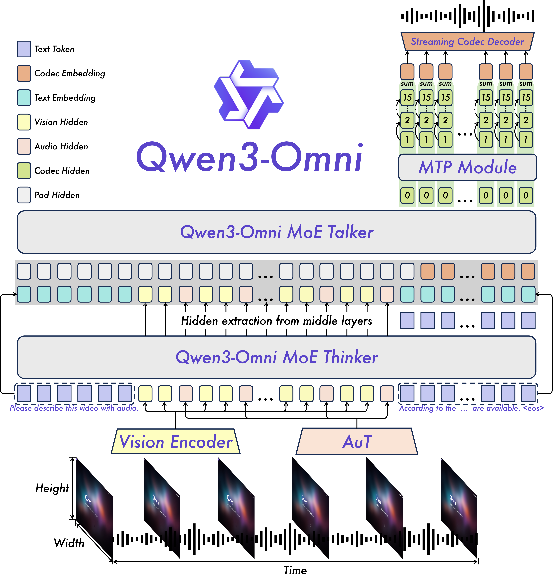

## 引言：大一统多模态大模型

<!-- 背景：单模态大模型的局限 -->


过去几年，尽管 GPT 系列在问答、编程、创作上不断刷新纪录，但它们都只能处理文本输入，无法直接感知视觉和听觉信息。与仅聚焦文本、对声画“关门”的单模态 GPT 大模型不同，人类天然是多模态智能体，能同步感知视觉与听觉并借文字、语音或动作完成信息交流。

Omni-Model（大一统多模态模型）试图刻画不同模态信息之间的互补与协同关系，将文本、图像、音频乃至视频信号映射到统一的语义空间，从而实现跨模态的联合推理与生成。其目标不仅是“能看会听”，更在于让模型像人一样，在复杂场景下灵活调用多模态线索，做出一致且可解释的决策。

## Qwen3-Omni 概览

Qwen3-Omni [^qwen3-omni] 模型架构采用“Thinker（语义模块）+ Talker（表述模块）”的双塔结构：Thinker 专注文本理解与生成，Talker 则依据 Thinker 输出的语义表征实时合成自然语音。下面的架构图还包含以下模块：

* Vision Encoder：将视觉信息转化为 token 序列
* AuT（Audio Transformer）：将音频信息转化为 token 序列
* MTP（Multi-Token Prediction）：预测后续输出语音的离散编码
* Streaming Codec Decoder：将 MTP 输出的离散编码转换为自然语音（声波）

<figure>
  
  <figcaption>Qwen3-Omni 总体架构（Thinker-Talker + MTP + 流式 Codec 解码）</figcaption>
</figure>


## 数据流全链路：从输入到输出发生了什么

与纯文本大语言模型类似，模型在推理时会构造 messages 列表，其中每条 message 承载当前轮次交互所携带的模态信息；在 Qwen3-Omni 中，单条 message 可同时包含语音、图像、视频与文本。

```python
messages = [
    {
        "role": "user",
        "content": [
            {"type": "audio", "audio": "/path/to/audio.wav"},
            {"type": "image", "image": "/path/to/image.png"},
            {"type": "video", "video": "/path/to/video.mp4"},
            {"type": "text", "text": "Describe the audio, image and video."},
        ],
    },
]
```

经过预处理和模型推理后，最终会生成文本序列和语音序列。以下展示模型推理的源代码流程：

```python
text = processor.apply_chat_template(messages, add_generation_prompt=True, tokenize=False)
audios, images, videos = process_mm_info(messages, use_audio_in_video=use_audio_in_video)
inputs = processor(text=text, audio=audios, images=images, videos=videos, return_tensors="pt",  padding=True, use_audio_in_video=use_audio_in_video) 
inputs = inputs.to(model.device).to(model.dtype) 
text_ids, audio = model.generate(**inputs, xxx) # xxx 为其他参数，如 max_new_tokens、do_sample、speaker 等
```

### 数据预处理

`apply_chat_template` 负责把用户传来的多轮对话 messages 按照模型预定义的 prompt 模板拼接成一段纯文本，为后续 tokenizer 提供统一的文本入口；拼接时会通过特殊字符串标明对话角色和模态信息的边界。例如下面的例子：

<a id="prompt-template"></a>

```python
prompt = """<|im_start|>user
<|audio_start|><|audio_pad|><|audio_end|><|vision_start|><|image_pad|><|vision_end|><|vision_start|><|video_pad|><|vision_end|>Describe the audio, image and video.<|im_end|>
<|im_start|>assistant
"""
```

`process_mm_info()` 则在拼接前扫描 messages，把其中 `audio/image/video` 字段的文件路径或字节流提取出来，返回可供后续编码器读取的原始模态数据列表。


`processor` 再把“已模板化的文本”与“已提取的音频、图像、视频”一起送入各自的子编码器（文本 tokenizer、音频 AuT、视觉 Vision Encoder 等），最终打包成 PyTorch 张量，供模型 forward 阶段一次性并行计算。下面列出部分关键张量及其形状：

```python
# 文本序列的token表示，每个数字表示token的索引
input_ids: torch.Size([1, text_token_length])
pixel_values: torch.Size([image_token_length, 1536]) 
pixel_values_videos: torch.Size([video_token_length, 1536])
input_features: torch.Size([B, feature_size, T])
```

### Tokenize

基于 Transformer 的模型设计中，核心问题之一是如何把不同形态的输入转化为 token 序列（可理解为一个 N×D 的矩阵，N 为序列长度，D 为 token 维度）。在预处理阶段，各模态会被转化为长度不同的 token 序列，常见做法包括：
* 文本：将字符串分词为 token，得到 token id 序列；随后通过 Embedding 层映射为向量序列
* 图像：Vision Encoder 将每张图像切分为 patch（如 16×16），再经线性投影得到视觉 token；多图/多帧可按顺序拼接，对应张量 `pixel_values`
* 音频：使用 AuT（Audio Transformer）等声学编码器，将波形转为特征序列并进一步编码为音频 token（可类比 Whisper[^whisper] 的前端与编码流程）
* 视频：通常先抽帧后按“图像”方式编码；若包含音轨，则音频轨道按“音频”方式编码，最终共同形成 `pixel_values_videos`

最终 processor 会把三种模态的 token 按 prompt 模板中的出现顺序插到文本 token 流里，组成一条统一的“多模态长序列”，再整体送进 Transformer。

### Thinker-Talker 分层推理

前文提到，Qwen3-Omni 采用双塔结构：Thinker 负责文本理解与生成，Talker 则根据 Thinker 输出的语义表征实时合成自然语音，二者在推理阶段依次执行。在 `model.generate` 中，核心流程的伪代码如下：

```python
# 1. 文本生成 (Text Generation)
thinker_result = thinker.generate(input_ids, output_hidden_states=True)
# 2. 模态对齐与特征桥接 (Modality Alignment & Bridging)
talker_inputs, trailing_text = align_and_project_features(thinker_result.hidden_states)
# 3. 声学特征预测 (Acoustic Feature Prediction)
talker_result = talker.generate(inputs_embeds=talker_inputs, trailing_text=trailing_text)
audio_codes = extract_codes(talker_result)
# 4. 波形重建 (Waveform Decoding)
wavs = code2wav.chunked_decode(audio_codes, chunk_size=300)
```
整个端到端推理过程可分为四个阶段：
1. 文本生成 ：核心模型（Thinker）处理多模态输入并自回归生成文本回复，同时输出每步的隐层状态；
2. 特征桥接 ：提取 Thinker 的浅层和深层特征，将文本与多模态信息投影到声学语义空间，作为语音合成的条件；
3. 声学预测 ：语音生成模型（Talker）接收桥接特征，自回归地预测离散音频编码（Audio Codes）；
4. 波形重建 ：流式解码器（Code2Wav）通过分块解码策略，将离散编码实时转换为最终的音频波形。


> **<span style="color:#2ECC71">NTP 推理过程</span>**: <span style="color:#2ECC71">上述“文本生成”属于标准的 NTP（Next Token Prediction）任务：模型依据当前输入序列，逐轮自回归地预测下一个 token。更具体地说，在 `generate` 内部，每轮都会调用 Thinker/Talker 输出概率分布，再经 Top-p/Top-k 等采样确定下一个 token；随后将其追加到序列末尾，循环直至生成完整的文本序列。</span>
> 
> **<span style="color:#2ECC71">KV Cache</span>**: <span style="color:#2ECC71">为了避免对已生成 token 重复计算 Key/Value 向量，系统会维护 KV cache：每步只计算新增 token 的 K/V，并与缓存拼接。这样，序列变长时 Thinker/Talker 的推理延迟通常保持近似线性增长，而不至于出现二次级别的计算开销。</span>

### 不同模态间的交互与融合

为了实现不同模态之间的交互与融合，Qwen3-Omni 会将来自文本、图像、音频、视频等模态的 token 按照 prompt 中的出现顺序拼接成一条统一的长序列，并将其整体输入 Transformer。在自注意力机制作用下，不同模态 token 可以相互建立关联，从而得到融合后的表征与输出序列。

而要实现这一点，Qwen3-Omni 会进行以下步骤：
* 统一不同模态的 token 维度：将不同模态的 token 序列（如文本 token、图像 token、音频 token、视频 token）映射到统一的特征维度（如 768、1024 等），一般通过映射层（如 Linear）实现。
* 合并不同模态的 token 序列：将不同模态的 token 序列按 prompt 中的出现顺序拼接成一条统一的长序列，作为 Transformer 的输入。如上文（见：[prompt 模板示例](#prompt-template)），其中的 `<|audio_start|><|audio_pad|><|audio_end|>` 用于标记音频 token 的起始与结束位置；图像与视频 token 同理。

## 小结

本篇笔记主要想解释 Qwen3-Omni 的“推理期数据流”与“融合方式”。但是还有其他Qwen3-Omni的其他设计未提及，包括但不限于：
* Transformer 模型设计细节（如注意力结构、位置编码、长上下文策略等）
* Omni-modal 的训练工程与数据科学（数据构造、对齐信号、损失与混训策略等）
* 语音后处理模块（MTP 与 Code2Wav）：语音生成链路与文本生成链路在目标与解码细节上并不完全一致，建议结合论文与代码对照理解

> **<span style="color:#FF6B35">如有错误或遗漏，欢迎指正！</span>**


[^qwen3-omni]: Jin Xu et al., *Qwen3-Omni Technical Report*, arXiv:2509.17765. https://arxiv.org/abs/2509.17765
[^whisper]: Radford, Alec, et al. "Robust Speech Recognition via Large-Scale Weak Supervision." https://github.com/openai/whisper
